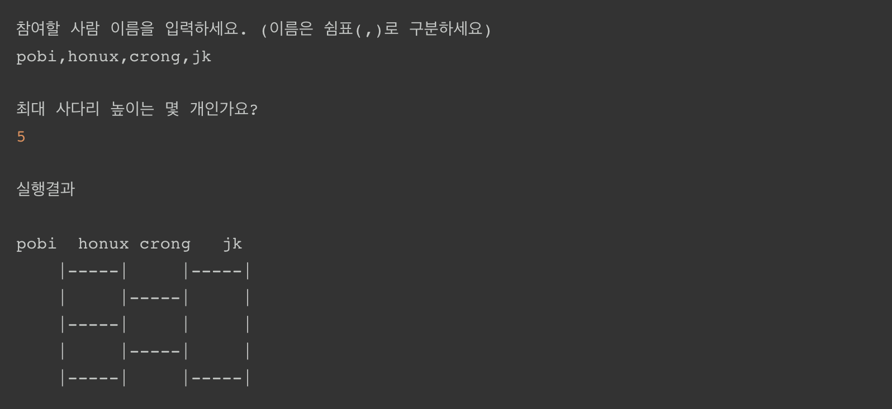

# 사다리 게임

### 기능 요구사항
- 사다리 게임에 참여하는 사람에 이름을 최대5글자까지 부여할 수 있다. 사다리를 출력할 때 사람 이름도 같이 출력한다.
- 사람 이름은 쉼표(,)를 기준으로 구분한다.
- 사람 이름을 5자 기준으로 출력하기 때문에 사다리 폭도 넓어져야 한다.
- 사다리 타기가 정상적으로 동작하려면 라인이 겹치지 않도록 해야 한다.
- |-----|-----| 모양과 같이 가로 라인이 겹치는 경우 어느 방향으로 이동할지 결정할 수 없다.

### 실행결과

### 기능 목록
1. 사다리 만들기
    - 세로 라인 : == 참가자 수
    - 가로 라인 : == 입력한 사다리 높이
    - 현재 사다리 위치에서 왼쪽, 오른쪽으로 이동할 수 있는지 확인이 가능해야한다.
    - 랜덤으로 사다리가 생성이 되어야 한다.
    - 사다리는 가로로 한 줄씩 관리한다.

2. 사용자 입력받기

3. 실행 결과 출력